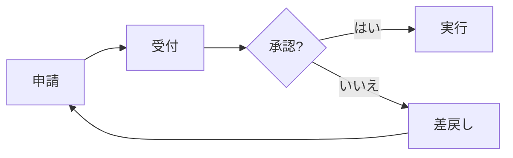

# 申請・承認フロー

申請と承認の間に受付を追加しました。

```mermaid
flowchart LR
  A[申請] --> E[受付]
  E --> B{承認?}
  B -->|はい| C[実行]
  B -->|いいえ| D[差戻し]
  D --> A
```

差し戻し先は申請です。ソースは [approval-workflow.mmd](approval-workflow.mmd)。
